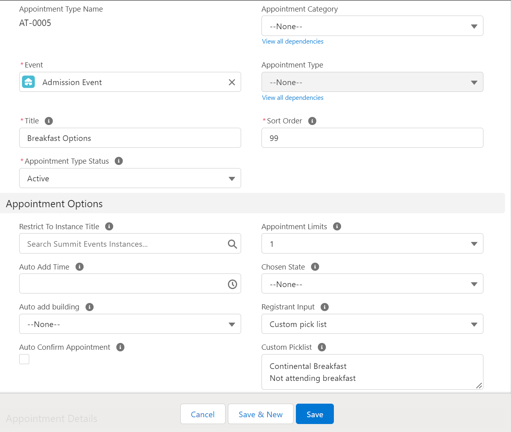
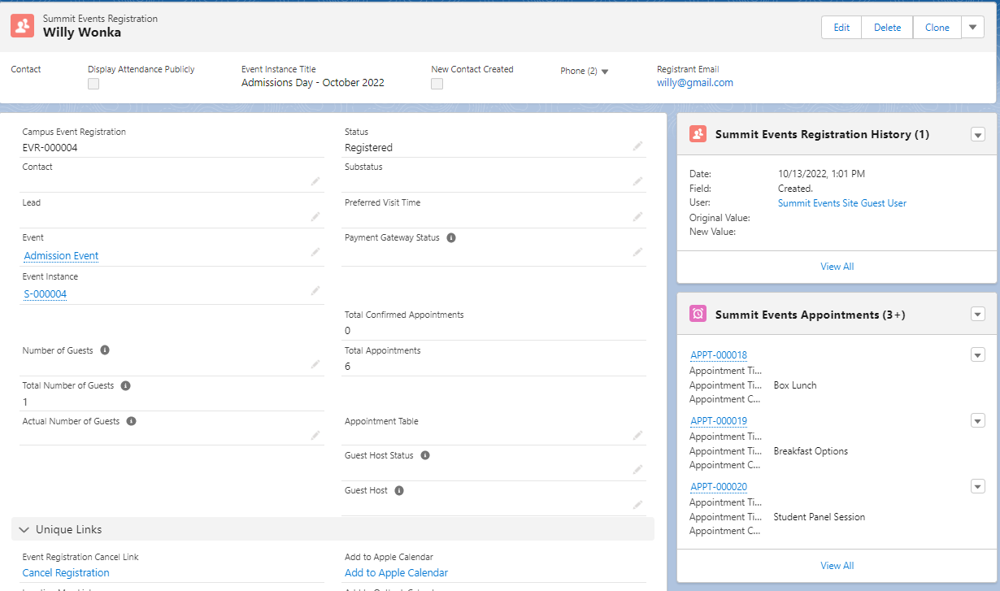

# Creating and Managing Event Appointments

Appointments are extremely flexible and can be used for a number of different scenarios.  Appointments allow the registrant to select multiple options during the registration process.  They also allow for time based options which is one way they differ from questions.   This documentation is going to cover all the basic fields needed to setup new event appointments.   In this scenario, appointments are bging used to let students to choose options they will be attending during the event.

Basic steps needed to set up appointments:
1. [Create an event with an event instance](https://sfdo-community-sprints.github.io/summit-events-app-documentation/docs/Getting-Started/create-basic-event/)
2. Configure the appointment option details
3. Create the appointment

Once the event and event instance have been created, you'll be able to configure the Appointment Option details on the Event page and create the appointments.

## Configure the Appointment Option Details
When creating or editing an Event page, use the Appointment Page Option section to configure the Event Appointment Title and Event Appointment Description.  

These will appear above the Appointments on the registration screen.

## Create Appointments
Starting on the Summit Event page, from Appointment type related list, choose New.

Since we started from the Event page, the Event field should default to the correct event.  If not, use the search feature to search for and select the correct event.

Give the appointment a Title.  This appears as the title of the appointment item.

The Appointment Type Status will default to Active.  Leave the default value.

Change the Sort Order to reflect the order in which the item should appear (optional).

Most of the time, you will use the Registrant Input field to set up your appointment options as this gives the greatest flexibility.

In the Appointment Options section, set the following fields:
* Registrant Input - choose the type of information being collected for this appointment (custom picklist, custom picklist required, text, text required).
* Custom Picklist - if using custom picklist as the registrant input, add the picklist values for selection.  Multiple items should be entered with a hard return in between each.

Click Save to save the new appointment.

Repeat this process for each appointment needed.  

The registrant's appointment selections appear on the Summit Events Appointments related list of the person's Summit Events Registration record.

On the appointment page, the item selected appears in the Description field.  The appointment type name appears in the Appointment Title field.

