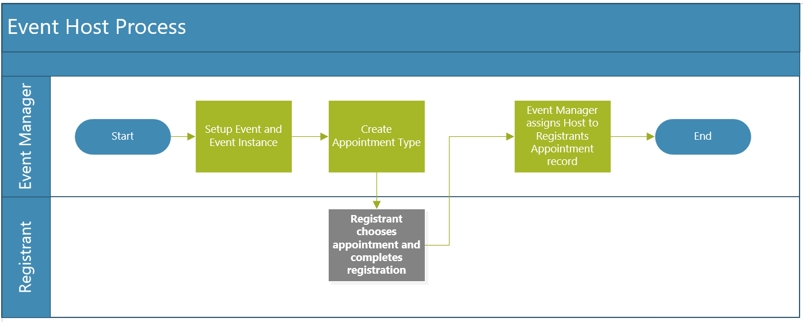
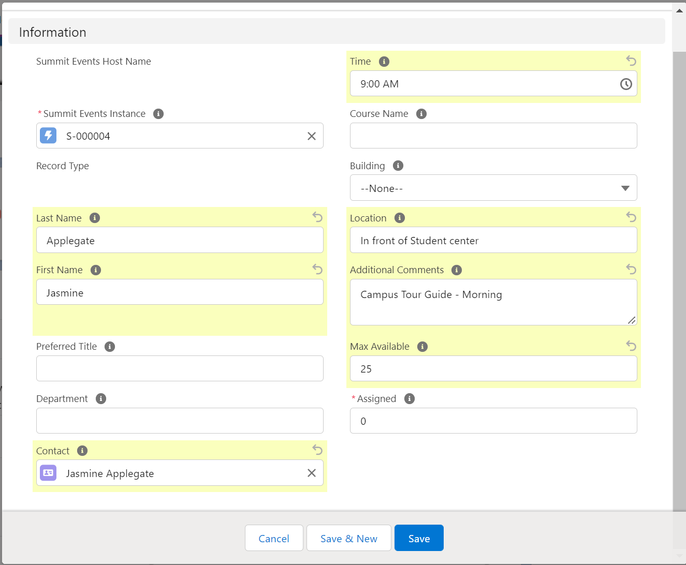

The event host feature, is a backend feature which allows the event manager to create event hosts that can later be assigned by the event manager to specific registrants appointments.  Hosts are things like visiting with a coach or admission counselor or even a housing host for an overnigh visit.  You can create an event host for a specific event instance and it can be applied to appointments on an event registration record.

# Create an Event Host

1.	To create an event host from an event instance, hover the cursor to the “Summit Event Hosts” on the Summit Event Instance page. A lookup list of all related event hosts will show up. Click the New Summit Event Host to create a new event host.  

2. Complete the fields related to your new Host and save the record.  In our example, Jasmine is going to do the morning campus tour during our event.  At minimum, you'll want to enter the hosts name information.  If they are a contact in Salesforce, you can also link to their contact record.  We've specified the 25 as the Max Available as each campus tour guide should have no more than 25 people assigned to their group.

3. Next we'll create an Appointment Type record for our Campus tour that our registrant can select during the registration process.  Starting from the Event Instance, well select the New button from the Summit Events Appointment Type related list.  Depending upon how your page layout is setup, this may be a button directly on the related list or you may need to click on the drop-down arrow and choose New as shown in this example.

4. Complete the desired fields.  Since our Use Case is a campus tour, we can select Campus Tour from the predefined options Appointment Category drop-down.  If none of the options here meet your needs, you can use the custom picklist feature to create your own.  We'll want to make sure that the proper Event and Event Instance are chosen and complete any other desired information.  Once complete save the new Appointment Type record.

Our setup is complete!  Now the Event Manager can assign host's to the registrants Appointment records.   See Assigning Host's to Registrant Appointmenst for additional details.

 
 
 
 

## Summit Event Host Detail (Field Informaton)
**Summit Event Host Name**: An identification number of each event host. It is a standard Salesforce field and displays in a format of HOST-{0000}. The system will automatically generate and assign a number to this field once an event host is created. No need for any user input and this field cannot be edited.

**Summit Event Instance**: The event instance that the event host belongs to. It is a lookup field that relates to the Summit Event Instance object. As mentioned above, the value must be matched with a record in the Summit Event Instance object. When you hover the cursor over to the Summit Event Instance field on the View page, a mini page of the event instance will show up.
 
_Note: The Summit Event Instance object and Summit Event Host object have a Master-Detail relationship and the Summit Event Instance is the master object. An event host must belong to one event instance. If an event instance is deleted, all related event hosts will be deleted too. Although the event host belongs to an event instance, the event host is directly related to a specific appointment in a registration for a certain event instance. For more details, please refer to “How to assign an event host?” below._

**Record Type**: The event host record type that you choose in Step 2 above. You can still modify the event host record type after Step 2.

**Last Name**: Last name of the host (if any). 

**First Name**: First name of the host (if any).

_Note: For overnight hosting, the last and first name is usually the name of the responsible person such as an admission officer/student ambassador._

**Preferred Title**: The preferred title of the host (Professor, Dr., Burgermeister Meisterburger).

**Gender**: The gender of the host. It is very important for overnight hosting. 

**Undergrad Major**: The undergraduate major that the host is pursuing. 

**Department**: The department where the host is working.

**Contact**: The contact record in the Salesforce for the host. The value in this field must be matched with a contact record in the system. You can manually enter a value or use the lookup form by clicking the lookup button on the right. 

**Time**: The time of the hosing. The data type of this field is Time.

**Formatted Time**: The value of the Time field that is in “12-hour AM/PM” format. The data type of this field is Formula(Text).

**Course Name**: If the event host record type is Class, then this field should have the value of the name of the hosting course. 
 
**Building**: The name of the building where the hosting will be happening. You can select a St. Thomas building from a dropdown list.

**Location**: Room and building number, address, where hosting will be happening.

**Additional Comments**: Additional comments about the host that will appear in any generated itinerary. 

**Max Available**: The number of registrants this host can accommodate.

**Assigned**: The number of registrants currently assigned to this host. For more details, please refer to “How to assign an event host?” below.

**Remaining**: The remaining amount of spaces left in the max capacity of registrants a host can take. Remaining=Max Available-Assigned. 

